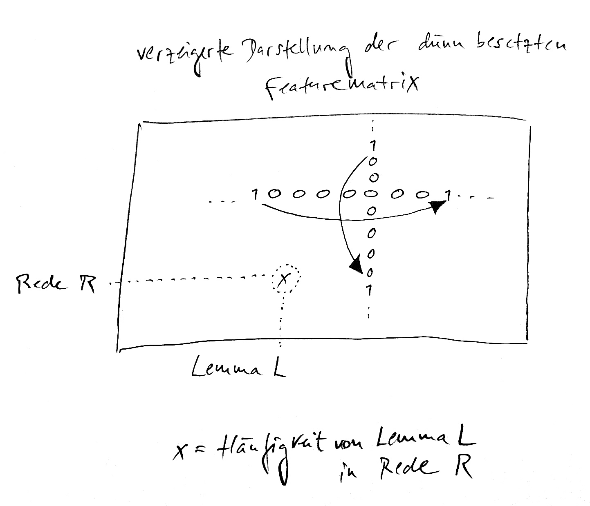
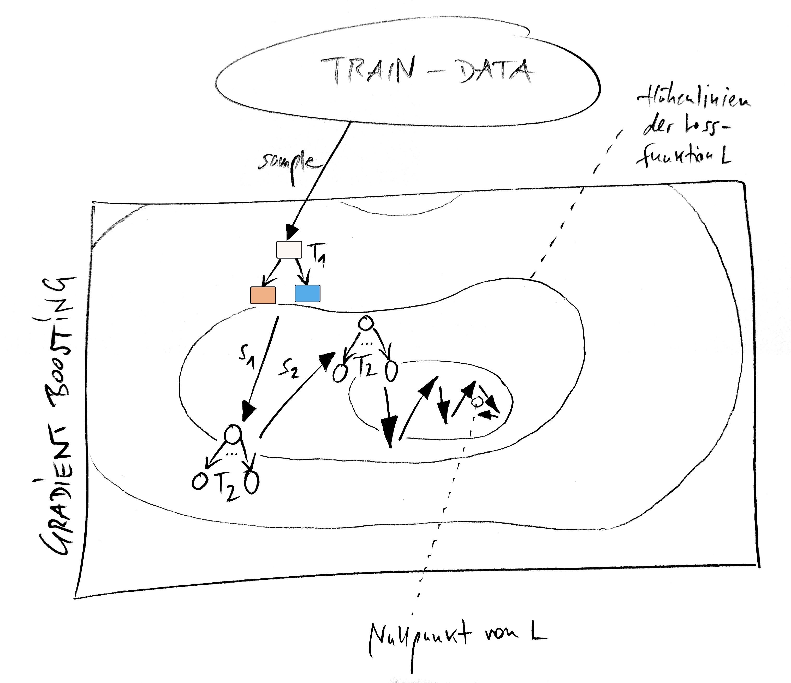

# Machine Learning Boosting

This Jupyter-Notebook is also part of [codecentric's AI Bootcamp](https://bootcamp.codecentric.ai/).

The interactive notebook illustrates the concepts of
- sparse matrix representation,


  
- Bagging,
- AdaBoost,
- Gradient Boosting,



- and XGBoost.

Have fun!

# Build and run locally

```bash
git clone https://gitlab.codecentric.de/bert.besser/ml-boosting-basics
cd ml-boosting-basics
docker build -t ml-boosting-basics .
docker run --name ml-boosting-basics -p 8888:8888 -v $(pwd)/notebooks:/notebooks ml-boosting-basics
```

- Then open browser and navigate to the [notebook](http://localhost:8888).
- Open and run `ml-boosting-basics.ipynb`.
